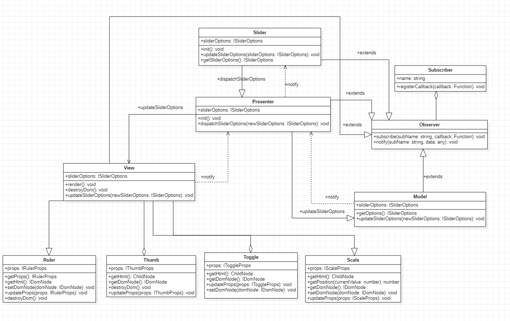

# RangeSlider (jQuery plugin)

[Просмотр](https://dywork.github.io/range-slider/)

## Установка

```
$ git clone https://github.com/dywork/range-slider.git
$ cd range-slider
$ npm install
$ npm run build
```

## Команды

Запуск: 
`npm start`

Сборка: 
`npm run build`

Тесты: 
`npm run test`

Деплой на github page: 
`npm run deploy`

## Использование
Слайдер по умолчанию:
```html
<div id="defaultSlider"></div>
```
```javascript
const defaultSlider = $('#defaultSlider').rangeSlider();
```
Слайдер со своими настройками:
```html
<div id="customSlider"></div>
```
```javascript
const defaultSlider = $('#customSlider').rangeSlider({
    currentValue: 15,
    range: { min: 10, max: 30 },
    isRuler: true,
    isThumb: true,
  });
```

 Настройки по умолчанию:
```javascript
const defaultOptions = {
  currentValue: 10,
  range: {
    min: 10,
    max: 30,
  },
  isThumb: true,
  isRuler: false,
  step: 1,
  orientation: 'horizontal',
}
```

## Настройки
| Название  | Тип  | Значение по умолчанию | Описание |
| :------------: |:---------------:| :---------:|:--:|
| currentValue     | number \| number[] | 10 | Задает текущее значение слайдера, 1 число - слайдер с одним значением, 2 числа в массиве - слайдер с интервалом |
| range     | { min: number; max: number } | range.min: 10, range.max: 30 |  Задает минимально и максимально возможное значение слайдера
| isThumb | boolean | true | Определяет показывать ли подсказку над тогглом с его текущим значением |
| isRuler | boolean | false | Определяет показывать ли линейку(шкалу) со всеми возможными значениями слайдера |
| step | number | 1 | Шаг значений |
| orientation | string | horizontal | Определяет горизонтальный или вертикальный вид слайдера. Для горизонтального значение - 'horizontal', для вертикального - 'vertical' |

## Архитектура приложения
UML диаграмма:
​

**Приложение разделенно на три слоя**
1) **Model** - содержит бизнес-логику приложения и не производить никаких расчетов, которые нужны для отображения.
 
2) **View** -  слой для управления отображением. Содержит логику, связанную с отображением (например, для изменения положения ползунка слайдера на экране), а также реагирует на взаимодействие пользователя с приложением.

3) **Presenter** - слой для обновления Model и View. Реагирует на сообщения от View о действиях пользователей и обновляет Model. Реагирует на сообщения об обновлении Model и обновляет отображение.

**Observer** - создаёт механизм подписки, позволяющий одному объекту следить и реагировать на события, происходящие в другом объекте.

**Ruler, Thumb, Toggle, Scale** - компоненты необходимые для декомпозиции View. Каждый компонент отрисовывает свой элемент слайдера. 
